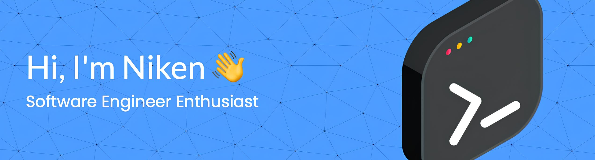

🫐 I love software engineering. I’m currently learning iOS development and software testing, but I love exploring project management too!

#### Experience

##### 🖥️ Web Development

##### 📱 Mobile Development

##### 🧠 Data & Machine Learning

##### 🔬 Quality Assurance

##### 📊 Others

  

  <picture>
    <source media="(prefers-color-scheme: dark)" srcset="https://raw.githubusercontent.com/nikenuv/nikenuv/output/pacman-contribution-graph-dark.svg">
    <source media="(prefers-color-scheme: light)" srcset="https://raw.githubusercontent.com/nikenuv/nikenuv/output/pacman-contribution-graph.svg">
    
  </picture>

